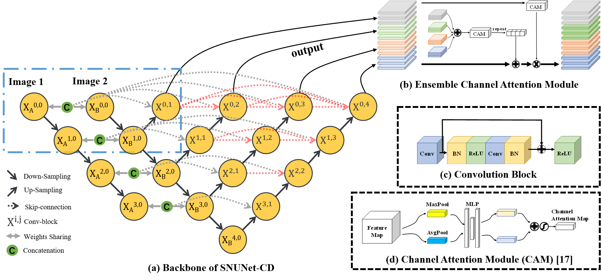

# SNUNet-CD


[](https://paperswithcode.com/sota/change-detection-for-remote-sensing-images-on?p=snunet-cd-a-densely-connected-siamese-network)





### News: :gift::gift::gift: SNUNet-CD is supported in [OpenCD](https://github.com/likyoo/open-cd/) and gets better results !!! You can find something [here](https://github.com/likyoo/open-cd/tree/main/configs/snunet). Enjoy it ~ :yum::yum::yum:

The pytorch implementation for "[SNUNet-CD: A Densely  Connected Siamese Network for Change Detection of VHR Images](https://ieeexplore.ieee.org/document/9355573) ". The paper is published on IEEE Geoscience and Remote Sensing Letters. 

Our conference version "[Siamese NestedUNet Networks for Change Detection of High Resolution Satellite Image](https://dl.acm.org/doi/abs/10.1145/3437802.3437810)" is published on CCRIS 2020: *2020 International Conference on Control, Robotics and Intelligent System*. Its implementation (Siam-NestedUNet) is archived in [Tag v1.1](https://github.com/likyoo/Siam-NestedUNet/tree/v1.1) .

## Requirements

- Python 3.6

- Pytorch 1.4

- torchvision 0.5.0

```
# other packages needed
pip install opencv-python tqdm tensorboardX sklearn
```

## Dataset

- [CDD](https://drive.google.com/file/d/1GX656JqqOyBi_Ef0w65kDGVto-nHrNs9/edit) (Change Detection Dataset)
- paper: [Change detection in remote sensing images using conditional adversarial networks](https://www.int-arch-photogramm-remote-sens-spatial-inf-sci.net/XLII-2/565/2018/isprs-archives-XLII-2-565-2018.pdf)

## Train from scratch

    python train.py

## Evaluate model performance

    python eval.py

## Visualization

    python visualization.py

## Pre-trained models

The pre-trained models in CDD dataset are available. 

[google drive](https://drive.google.com/drive/folders/1_aoUvMC8zWy4Pv7vU_BHu5yzzjgIsNXv?usp=sharing) | [baidu disk](https://pan.baidu.com/s/1i8LeBdMyR5jTWPTTB1XZUA) (w90j)


## Citation

If you find this work valuable or use our code in your own research, please consider citing us with the following bibtex:

```
@inproceedings{10.1145/3437802.3437810,
author = {Li, Kaiyu and Li, Zhe and Fang, Sheng},
title = {Siamese NestedUNet Networks for Change Detection of High Resolution Satellite Image},
year = {2020},
isbn = {9781450388054},
publisher = {Association for Computing Machinery},
address = {New York, NY, USA},
url = {https://doi.org/10.1145/3437802.3437810},
doi = {10.1145/3437802.3437810},
abstract = {Change detection is an important task in remote sensing (RS) image analysis. With the development of deep learning and the increase of RS data, there are more and more change detection methods based on supervised learning. In this paper, we improve the semantic segmentation network UNet++ and propose a fully convolutional siamese network (Siam-NestedUNet) for change detection. We combine three types of siamese structures with UNet++ respectively to explore the impact of siamese structures on the change detection task under the condition of a backbone network with strong feature extraction capabilities. In addition, for the characteristics of multiple outputs in Siam-NestedUNet, we design a set of experiments to explore the importance level of the output at different semantic levels. According to the experimental results, our method improves greatly on a number of indicators, including precision, recall, F1-Score and overall accuracy, and has better performance than other SOTA change detection methods. Our implementation will be released at https://github.com/likyoo/Siam-NestedUNet.},
booktitle = {2020 International Conference on Control, Robotics and Intelligent System},
pages = {42–48},
numpages = {7},
keywords = {Change Detection, Remote Sensing Image Processing, Fully Convolutional Siamese Network, Deep Learning},
location = {Xiamen, China},
series = {CCRIS 2020}
}
```


```
@ARTICLE{9355573,
  author={S. {Fang} and K. {Li} and J. {Shao} and Z. {Li}},
  journal={IEEE Geoscience and Remote Sensing Letters}, 
  title={SNUNet-CD: A Densely Connected Siamese Network for Change Detection of VHR Images}, 
  year={2021},
  volume={},
  number={},
  pages={1-5},
  doi={10.1109/LGRS.2021.3056416}}
```


## Contact Information

Kaiyu Li: likyoo@sdust.edu.cn


## References

Appreciate the work from the following repositories:

- [granularai / chip_segmentation_fabric](https://github.com/granularai/chip_segmentation_fabric)
- [wenhwu/awesome-remote-sensing-change-detection](https://github.com/wenhwu/awesome-remote-sensing-change-detection)
- [luuuyi/CBAM.PyTorch](https://github.com/luuuyi/CBAM.PyTorch)

